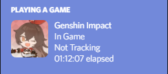
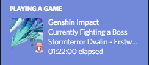

# Genshin Impact Rich Presence v2.6

  

> - **Windows only**
> - **Game text language must be English**
> - **Location detection**: Works best when traveling between places (location text appears longer), but teleporting works too with fallback map detection (i.e. "thinking of traveling to location")
> - **Automatic resolution detection**: Works with any resolution (720p, 1080p, 1440p, 2160p, ultrawide, etc.)
> - **Party setup**: Works with any number of characters (1-4) in party, works for Single Player mode only
> - **Modern GUI interface**: User-friendly configuration and monitoring
> - **Adaptive character detection**: Automatically adjusts to UI changes

This Discord Rich Presence doesn't tamper with Genshin Impact game files in any way. It works by scanning text in screen captures using OCR (Optical Character Recognition).

-----

## 🚀 Quick Start

### GUI Version (Recommended - Easiest)
1. **Double-click `start_gui.bat`** (or run it from command line)
2. Configure your settings in the GUI:
   - Enter your Genshin Impact username
   - Select your main character (Aether/Lumine)
   - Set Wanderer name if applicable
3. Click **"Start Rich Presence"**
4. The application will automatically detect your game and update Discord

### Alternative Methods

#### Direct GUI Launch:
```bash
python_embedded\python.exe genshin_impact_rich_presence_gui.py
```

#### Console Mode:
```bash
python_embedded\python.exe main.py
```

-----

## 📋 Setup Guide

### 1. System Requirements

- **Windows 10/11**
- **Python 3.11+** (embedded version included in `python_embedded/`)
- **NVIDIA GPU** recommended (with recent drivers >525 for best OCR performance)
- **Genshin Impact** with English text language

### 2. Configuration (GUI Method - Recommended)

**Most users don't need to edit any config files!** The GUI handles all user configuration:

1. Launch the GUI using `start_gui.bat`
2. Use the **Configuration** tab to set:
   - **Username**: Your Genshin Impact username
   - **Main Character**: Aether or Lumine
   - **Wanderer Name**: Your custom Wanderer name (if renamed)
   - **GPU Acceleration**: Enable for better OCR performance

### 3. Advanced Configuration (Optional)

For advanced users who need manual configuration, edit [CONFIG.py](CONFIG.py):

⚠️ **Important**: Most settings in CONFIG.py are now **legacy** and configured through the GUI. Changes made here may be overridden by GUI settings.

**Legacy Settings (use GUI instead):**
- `USERNAME` → Configure in GUI's "Username" field
- `MC_AETHER` → Configure in GUI's "Main Character" dropdown
- `WANDERER_NAME` → Configure in GUI's "Wanderer Name" field
- `GAME_RESOLUTION` → Now auto-detected (rarely needs manual override)

**Still relevant settings:**
- `USE_GPU` → Enable GPU acceleration for OCR
- Screen coordinates → Usually auto-detected, manual config rarely needed

### 4. GPU Acceleration (Recommended)

The application uses EasyOCR for text recognition. GPU acceleration significantly improves performance:

- **Enabled by default** in both GUI and CONFIG.py
- Requires CUDA-compatible NVIDIA drivers
- The embedded Python includes PyTorch with CUDA support
- Can be toggled in the GUI's Configuration tab

### 5. Start the Application

#### GUI Mode (Recommended):
- **Double-click `start_gui.bat`** or run `python_embedded\python.exe genshin_impact_rich_presence_gui.py`
- Click "Start Rich Presence" in the GUI
- Monitor activity in real-time through the GUI

#### Console Mode:
- Run `python_embedded\python.exe main.py`
- View status in the console window

The application will:
- ✅ Connect to Discord
- ✅ Start monitoring Genshin Impact
- ✅ Display your current activity, character, and location on Discord
- ✅ Show real-time status in the GUI

-----

## Contribution

### Data entry

The [data](data/) folder contains `.csv` (comma-separated values) data files that requires manual input. More information on how to edit these files can be found in the [data README](data/README.md).

Quite a few locations/points of interests may be missing from the current data, and as new domains/characters/bosses/locations get added, this project requires continuous updates to maintain these records.

The `.csv` data files have a hot-reload feature, so you don't need to restart the Discord RPC program to see effected changes to these files, you can enter them as you play the game and find unmarked locations/missing data.
-----

## 📁 Project Structure

```
├── start_gui.bat                    # 🚀 Quick launcher for GUI (recommended)
├── main.py                          # Console version of the application
├── genshin_impact_rich_presence_gui.py  # 🖥️ GUI version (recommended)
├── CONFIG.py                        # ⚙️ Configuration file (mostly legacy)
├── datatypes.py                     # 📋 Data type definitions
├── ocr_engine.py                    # 🔍 OCR processing engine
├── ps_helper.py                     # 🛠️ Process helper utilities
├── shared_config.json               # 🔄 GUI-main communication file
├── gui_shared_data.json             # 📊 Real-time data sharing
├── data/                           # 📊 Game data files
│   ├── characters.csv              # Character database
│   ├── locations.csv               # Location database
│   ├── domains.csv                 # Domain database
│   ├── bosses.csv                  # Boss database
│   ├── gamemenus.csv               # Game menu database
│   └── README.md                   # Data file documentation
├── DEV_resources/                  # 🛠️ Development resources
│   ├── requirements.txt            # Python dependencies
│   ├── for_debugging/              # Debug utilities
│   └── docs/                       # Documentation
├── python_embedded/                # 🐍 Embedded Python environment
├── easyocr_cache/                  # 💾 OCR model cache
├── resources/                      # 🎨 Assets and screenshots
│   ├── assets/                     # Images and icons
│   └── styles.qss                  # GUI styling
└── styles.qss                      # Additional GUI styles
```

## 🛠️ Troubleshooting

### Quick Diagnosis

**First, test if OCR is working:**
```bash
python_embedded\python.exe DEV_resources\for_debugging\test_imagegrab.py
```

**What to check:**
- Alt+tab to Genshin Impact and leave it running
- Change characters and visit different locations
- Check the terminal output for successful OCR detection
- Enable capture display windows in the debug script for visual verification

### Common Issues & Solutions

#### ❌ **"OCR not detecting text"**
- ✅ Ensure Genshin Impact is running in **English**
- ✅ The application **automatically detects** your resolution - no manual setup needed
- ✅ Verify GPU drivers are up to date (recommended for best performance)
- ✅ Try toggling `USE_GPU` in the GUI Configuration tab

#### ❌ **"GUI not responding / not updating"**
- ✅ Check the GUI log panel for error messages
- ✅ Ensure the subprocess is running (check Task Manager for `python.exe`)
- ✅ Verify file permissions for the application directory
- ✅ Try restarting the GUI

#### ❌ **"Discord not updating"**
- ✅ Confirm Discord is running and logged in
- ✅ Check that the Discord app is connected (green indicator in GUI)
- ✅ Verify internet connection
- ✅ Restart Discord if issues persist

#### ❌ **"Application won't start"**
- ✅ Use `start_gui.bat` instead of running Python directly
- ✅ Ensure no antivirus is blocking the application
- ✅ Check that `python_embedded\` folder exists and is intact
- ✅ Try running as administrator

#### ❌ **"Poor performance / lag"**
- ✅ Enable GPU acceleration in GUI Configuration
- ✅ Close other GPU-intensive applications
- ✅ Update NVIDIA drivers to latest version
- ✅ The app uses minimal resources when Genshin is minimized

### Advanced Debug Tools

Located in `DEV_resources/for_debugging/`:
- `test_imagegrab.py` - Test OCR image capture and text recognition
- `capture_ocr_regions.py` - Debug specific OCR regions
- `interactive_coordinate_calibrator.py` - Calibrate screen coordinates manually

### Getting Help

If issues persist:
1. Check the GUI log for detailed error messages
2. Run debug tools and note any error output
3. Ensure Genshin Impact is running in windowed or borderless mode
4. Try different GPU acceleration settings
5. Verify your Windows version and permissions

## 🙏 Credits & License

**Image Assets**: Intellectual property of HoYoverse © miHoYo. All rights reserved.

**Additional Images**: Some assets sourced from the [Genshin Impact Fandom Wiki](https://genshin-impact.fandom.com/).

**Project History**:
- **Original Implementation**: Created by [@ZANdewanai](https://github.com/ZANdewanai)
- **Reimplementation**: Reworked by [@euwbah](https://github.com/euwbah)
- **Current Version**: Further enhanced and GUI-ified by [@ZANdewanai](https://github.com/ZANdewanai)

**License**: See [LICENSE](LICENSE) for full licensing information.

---

## 📈 Recent Updates (v2.6)

- ✨ **New GUI Interface**: Modern PyQt5-based GUI with real-time monitoring
- 🎯 **Adaptive Character Detection**: Automatically adjusts to UI layout changes
- 🚀 **One-Click Launcher**: `start_gui.bat` for instant GUI startup
- ⚙️ **GUI-Based Configuration**: No more manual config file editing for most users
- 🔄 **Auto-Resolution Detection**: Works with any screen resolution automatically
- 🎮 **Real-Time Status**: Live activity monitoring in the GUI
- 🛠️ **Enhanced Troubleshooting**: Comprehensive debug tools and error handling
- 📊 **Shared Data System**: Seamless communication between GUI and OCR engine

**Legacy Settings Migration**: User settings previously in CONFIG.py are now configured through the GUI interface for better user experience.
