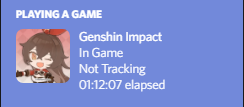
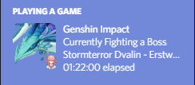

# Genshin Impact Rich Presence v3.0

  

A Discord Rich Presence for Genshin Impact that shows your current location,
activity, party, and playtime. It does not tamper with game files — it scans
text in periodic screen captures using OCR (RapidOCR on ONNX Runtime) and
translates what it sees into Discord status updates.

> - **Windows 10/11 only**
> - **GPU required** — OCR runs exclusively through DirectML (NVIDIA, AMD, or Intel); the app refuses to start without it
> - **Game text language must be English**
> - **Single Player mode only**, any party size (1–6)
> - Works at any resolution or aspect ratio (auto-detected, ultrawide included)

-----

## 🚀 Quick Start

1. Download the latest release ZIP from [**GitHub Releases**](https://github.com/ZANdewanai/Genshin-Impact-Rich-Presence/releases) and unzip it.
2. Double-click **`GenshinRichPresence.exe`**. No terminal, no Python install needed.
3. On first launch the app auto-creates `shared_config.json`. Open the
   **Settings** tab and enter:
   - Your Genshin Impact username
   - Your main character (Aether/Lumine)
   - Wanderer name, if you've renamed them in-game
4. Click **Start Rich Presence.** The app detects the Genshin window
   automatically and starts updating Discord. Discord must be running.

The settings tab shows a pulsing **SETUP** badge until the username is
configured, then reverts to **SETTINGS**.

> The release folder must remain intact — `RichPresenceEngine.exe` (the OCR +
> Discord engine) is spawned by the GUI and lives alongside it.

### Alternative Launch Methods

```bash
# Console-mode engine directly (OCR + Discord RPC, no GUI).
# Configured via CONFIG.py.
python3.12.8_embedded\python.exe main.py

# GUI in a terminal (development / debugging)
python3.12.8_embedded\python.exe webview_launcher.py
```

Console mode is intended for development or environments where the embedded
Python is used directly; the GUI exe is recommended for normal use.

-----

## ⚙️ Configuration

Most users configure everything through the GUI. Settings are stored in
`shared_config.json` (runtime-generated) and passed to the detection engine.

Advanced users can edit [CONFIG.py](CONFIG.py) directly:

- `USERNAME`, `MC_AETHER`, `WANDERER_NAME` — legacy; overridden by GUI settings
- `GAME_RESOLUTION` — auto-detected; manual override rarely needed (only for GPU-upscaling setups like DLDSR/DLSS)
- Manual screen coordinates — only needed for non-standard aspect ratios where auto-detection fails
- `USE_URL_ASSETS` / `ASSET_BASE_URL` — serve character/boss images to Discord from a URL instead of uploading assets (bypasses Discord's 300-asset limit)

-----

## ✨ How It Works

- **Screen capture → OCR → activity state.** The engine grabs the game window
  and reads region-specific text: location names, boss names, domain names,
  party slots, and menus.
- **Sensor worker architecture.** Character, location, and menu regions are
  scanned in dedicated worker threads coordinated via a shared blackboard,
  keeping the main loop responsive. A legacy sequential loop remains available
  (`USE_SENSOR_WORKERS = False`).
- **Adaptive character detection.** If UI scaling shifts the party HUD, the
  character name regions self-adjust within bounds instead of failing.
- **Hot-reloaded data.** The CSV files in `data/` reload on change — you can
  add missing locations/characters while playing without restarting.
- **OCR pauses when Genshin loses focus or is minimized**, so idle resource
  usage is minimal.

-----


## 🛠️ Troubleshooting

**Test if OCR works:**
```bash
python3.12.8_embedded\python.exe tools\test_imagegrab.py
```
Alt+tab into Genshin, switch characters, travel around, and watch the console output.

| Problem | Fix |
|---|---|
| OCR not detecting text | Ensure the game is in English; update GPU drivers; run `tools/test_imagegrab.py` |
| App won't start | Verify `builds/GenshinRichPresence/` is unzipped intact; allow it through antivirus; ensure `python3.12.8_embedded/` exists alongside the exes |
| Discord not updating | Confirm the Discord desktop app is running; restart Discord |
| Poor performance | Close other GPU-intensive apps; update GPU drivers |

Debug tools live in `tools/`: `test_imagegrab.py` (capture test),
`capture_ocr_regions.py` (region inspection),
`interactive_coordinate_calibrator.py` (manual coordinate calibration),
`test_sensors.py` (sensor architecture test).

### Building from source

Double-click **`build.bat`** (or run it from a terminal). It uses the bundled
Python + PyInstaller to produce a ready-to-distribute folder at
`builds\GenshinRichPresence\` containing:

- `GenshinRichPresence.exe` — the GUI
- `RichPresenceEngine.exe` — the headless OCR/Discord engine the GUI spawns

Close the app before building — running exes lock their DLLs.

-----

## 🙏 Credits & License

**Author**: Created, developed, and maintained by [@ZANdewanai](https://github.com/ZANdewanai).

**Image Assets**: Intellectual property of HoYoverse © miHoYo. All rights reserved.
Some assets sourced from the [Genshin Impact Fandom Wiki](https://genshin-impact.fandom.com/).

**License**: See [LICENSE](LICENSE).

### Contributing

Contributions welcome! Data entry is the biggest ongoing need — see
[data/GAME_DATA_DOCUMENTATION.md](data/GAME_DATA_DOCUMENTATION.md) and check
[GitHub Issues](https://github.com/ZANdewanai/Genshin-Impact-Rich-Presence/issues).
